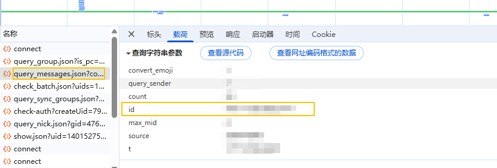

# 微博群聊天记录备份工具

Node.js 版本：v22.17.1

## 快速启动

1. **安装环境依赖**：
   ```bash
   npm install
   ```

2. **运行开发项目**：
   ```bash
   npm run dev
   ```
   应用会自动在浏览器打开 `http://localhost:5173`。

3. **使用教程**：  
   **3.1. 电脑浏览器登录微博网页点击到 进入到微博群里页面：`https://api.weibo.com/chat#/chat`**  
   **3.2. 点击F12，打开控制台，点击对应群聊查看请求获得里面的‘群聊ID’**  

      

   **3.3 访问 `https://localhost:5173/` 页面，点击到‘备份新纪录’页面，将下方的 [一键采集] 按钮拖动到您的浏览器书签栏**  
   **3.4 在微博聊天页面 `https://api.weibo.com/chat#/chat` 点击该书签，在弹出框里面输入前面拿到的‘群聊ID’即可选择备份最新还是历史的群聊记录。**  
   **3.5 如果有网络问题可以手动备份数据到 ./backups 目录存储**  
   **3.6 访问 `https://localhost:5173/` 页面，点击到‘备份新纪录’页面，点击‘从 ./backups 目录同步备份’按钮，点击‘历史备份’页面即可看到备份数据**  
