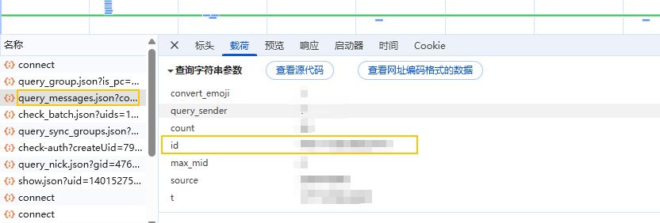

# 微博群聊天记录备份工具

Node.js 版本：v22.17.1

## 快速启动

1. **安装环境依赖**：
   ```bash
   npm install
   ```

2. **运行开发项目**：
   ```bash
   npm run dev
   ```
   应用会自动在浏览器打开 `http://localhost:5173`。

3. **使用教程**：  

   **3.1. 电脑浏览器登录微博网页点击到 进入到微博群里页面：`https://api.weibo.com/chat#/chat`**  

   **3.2. 点击F12，打开控制台，点击对应群聊查看请求获得里面的‘群聊ID’**  

      

   **3.3 访问 `https://localhost:5173/` 页面，点击到‘备份新纪录’页面，将下方的 [一键采集] 按钮拖动到您的浏览器书签栏**  

   **3.4 在微博聊天页面 `https://api.weibo.com/chat#/chat` 点击该书签，在弹出框里面输入前面拿到的‘群聊ID’即可选择备份最新还是历史的群聊记录。**  

   **3.5 备份数据逐页实时写入本地 MySQL（`127.0.0.1` / 库名 `weibo_group_chat` / 表 `chat_messages`，一行一条消息，按 `group_id + message_id` 去重）。  
         中途崩溃也不怕：已写入的页不会丢；再次跑历史模式时会提示从最旧消息断点续采。  
         请先在项目根目录配置 `.env`（host/port/user/password/database），并确保 MySQL 已启动；服务启动时会自动建表（若仍有旧表 `chat_archives` 会自动迁移后删除）。  
         若个别页 POST 失败，脚本会重试，仍失败则下载 `*_pending.json`，可在「备份新纪录」页载入导入。**  

   **3.6 访问 `https://localhost:5173/`，在「历史备份」查看群列表（只拉元数据）。打开某群后分页上下翻阅；支持按日跳转与关键词搜索。统计页走服务端 SQL 聚合，不会把百万消息灌进浏览器。**  
