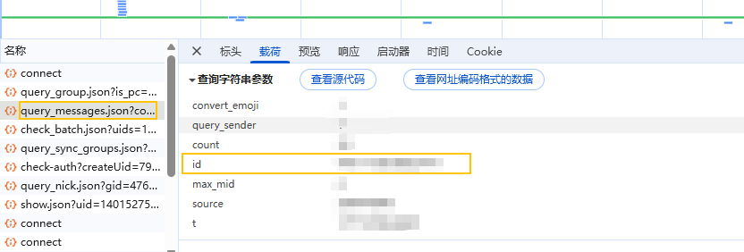

# 微博群聊天记录备份工具

Node.js 版本：v22.17.1

## 快速启动

1. **安装环境依赖**：
   ```bash
   npm install
   ```

2. **运行开发项目**：
   ```bash
   npm run dev
   ```
   应用会自动在浏览器打开 `http://localhost:5173`。

3. **使用教程**：  

   **3.1. 电脑浏览器登录微博网页点击到 进入到微博群里页面：`https://api.weibo.com/chat#/chat`**  

   **3.2. 点击F12，打开控制台，点击对应群聊查看请求获得里面的‘群聊ID’**  

      

   **3.3 访问 `https://localhost:5173/` 页面，点击到‘备份新纪录’页面，将下方的 [一键采集] 按钮拖动到您的浏览器书签栏**  

   **3.4 在微博聊天页面 `https://api.weibo.com/chat#/chat` 点击该书签，在弹出框里面输入前面拿到的‘群聊ID’即可选择备份最新还是历史的群聊记录。**  

   **3.5 备份数据逐页实时写入本地 MySQL（`127.0.0.1` / 库名 `weibo_group_chat` / 表 `chat_messages`，一行一条消息，按 `group_id + message_id` 去重）。  
         中途崩溃也不怕：已写入的页不会丢；再次跑历史模式时会提示从最旧消息断点续采。  
         请先在项目根目录配置 `.env`（host/port/user/password/database），并确保 MySQL 已启动；服务启动时会自动建表（若仍有旧表 `chat_archives` 会自动迁移后删除）。  
         若个别页 POST 失败，脚本会重试，仍失败则下载 `*_pending.json`，可在「备份新纪录」页载入导入。**  

   **3.6 访问 `https://localhost:5173/`，在「历史备份」查看群列表（只拉元数据）。打开某群后分页上下翻阅；支持按日跳转与关键词搜索。统计页走服务端 SQL 聚合，不会把百万消息灌进浏览器。**

## 常见问题（必读）

采集脚本从微博页面（`https://api.weibo.com`）请求本机 `https://localhost:5173` 写入数据，属于「公网页面访问本地网络」，会受两道限制。**如果书签运行后一直提示入库失败 / 控制台报 `Permission was denied ... 'loopback' address space` 或证书错误，按下面两节处理。**

### 问题一：Chrome 提示证书无效 / 证书过期

本服务的 HTTPS 证书由 [mkcert](https://github.com/FiloSottile/mkcert) 生成，有效期约 2 年，过期后浏览器会拒绝连接（网络面板表现为「CORS 错误」，很有迷惑性——请求根本没到达服务器）。更新方法：

1. 下载 mkcert（单文件免安装）：
   ```bash
   curl -L -o "%USERPROFILE%\.workbuddy\bin\mkcert.exe" https://github.com/FiloSottile/mkcert/releases/download/v1.4.4/mkcert-v1.4.4-windows-amd64.exe
   ```
   （或手动从 https://github.com/FiloSottile/mkcert/releases 下载 `mkcert-v1.4.4-windows-amd64.exe`）

2. 安装并信任本地 CA（首次使用需要，已安装会提示 already installed）：
   ```bash
   "%USERPROFILE%\.workbuddy\bin\mkcert.exe" -install
   ```

3. 在**项目根目录**重新生成证书（生成 `localhost+2.pem` 和 `localhost+2-key.pem`，正好覆盖旧文件）：
   ```bash
   cd /d D:\code\weibo-chat-archiver_new
   "%USERPROFILE%\.workbuddy\bin\mkcert.exe" localhost 127.0.0.1 ::1
   ```

4. 重启服务（WSL 里 `Ctrl+C` 后重新 `npm run dev`），浏览器访问 `https://localhost:5173/`，地址栏出现**锁图标、无警告**即成功。

> 注意：证书过期时浏览器上一次点过「继续前往」，可能一直没发现，排查时先看地址栏有没有锁图标。

### 问题二：Chrome 拦截「本地网络访问」（报 Permission was denied ... 'loopback' address space）

新版本 Chrome（实测 v152）默认禁止公网页面请求本机服务，会伪装成 CORS 错误，控制台完整报错为：
`... has been blocked by CORS policy: Permission was denied for this request to access the 'loopback' address space`。

关闭方法（一次即可）：

1. 地址栏打开 `chrome://flags`
2. 搜索 `local network`
3. 将 **`Local Network Access Checks`** 的下拉框从 `Default` 改为 **`Disabled`**（后面 WebRTC / WebSockets / WebTransport 三项依赖它，可一并改为 `Disabled`）
4. 点击页面提示的 **`Relaunch`** 重启浏览器
5. 重新打开微博聊天页 `https://api.weibo.com/chat#/chat`，再运行书签

> 补充：也可以在 `chrome://settings/content/localNetworkAccess` 的「允许访问本地网络中的其他设备」里添加 `api.weibo.com`（注意：书签运行在 `api.weibo.com` 页面，只添加 `weibo.com` 无效，Chrome 按精确主机名匹配）。但部分版本该设置不生效，**推荐直接用上面的 flags 方法**。

### 头像本地缓存（防微博改规则）

用户头像会自动落盘到项目根目录 `avatar-cache/`（按 URL 哈希命名）。加载优先级：**本地缓存 → 在线拉取（成功即落盘）→ 历史本地缓存 → 显示用户名首字**。即使以后微博封了外链或代理失效，已缓存过的头像仍能正常显示。

- 服务每次启动 3 秒后会自动预取 users 表所有头像到本地（并发 3，不阻塞服务，控制台会打印 `avatar prefetch done`）
- 手动全量预取/刷新：浏览器访问 `https://localhost:5173/api/avatars/prefetch`（加 `?force=1` 强制全部重新下载），返回 `{total, downloaded, cached, failed}` 统计

### 表情包本地化（防微博改规则 / 断网也能显示）

聊天里常见的 `[doge]`、`[允悲]`、`[二哈]` 等微博内置表情会先下载到本地 `emoji-assets/`，渲染时把 `[xx]` 文本替换成本地图片（图片在服务端静态托管，不依赖微博 CDN / 防盗链 / 外网）。

- **已内置表情**：`emoji-assets/` 下约 731 个表情（经典表情 + 聊天官方面板全套 + 新款表情），含 `manifest.json`（`{ "[doge]": "xxx.png" }`）。对全库消息的短语命中覆盖率约 94%（152607/162517 条含 `[xx]` 的消息可渲染本地图）。
- **数据来源（按合并优先级）**：
  1. `emoji-assets/chat-panel-source.json` —— 从微博网页版群聊表情面板抓取的官方映射（339 条，权威，含 [卡皮巴拉]/[柯基]/[流鼻血] 等新款）；
  2. weiboticons（微博官方 emotions API 全量，~1987 条经典动图）；
  3. guozaoke / weiboFace / Tlaster / sklme 社区收集的 gist 与 npm 数据。
- **路径式 token 破解**：微博聊天 API 会把 PUA 私有区字符转成 `[/ee8cbe.png]` 伪路径 token（`eeXXXX` 即 PUA 字符 U+E3XX 的 UTF-8 字节十六进制）。脚本按聊天前端 `convertEmoji` 官方规律还原为 `https://img.t.sinajs.cn/t4/appstyle/expression/emimage/eeXXXX.png` 直链下载，全库 300 种 token（1.3 万次出现）全部可解。
- **繁体短语别名**：港澳台客户端发的是繁体短语（[哆啦A夢吃驚]/[壞笑]/[偷樂] 等），构建时按内置 T2S 映射表为繁体 key 复用已下载的简体图。
- 未命中的短语仍原样显示文本，不影响其它功能。已知缺口：`[动画表情]`（media_type=15，独立 GIF 附件，本就走图片渲染）；`[好运连连]`/`[指定能行]` 等已下架季节表情；`[捂脸]`/`[旺柴]`/`[狗头]` 等 WeChat 风格短语；`[/cp]` 无扩展名 token。
- **重新构建 / 更新表情库**（联网、需本机能连数据库以统计覆盖率）：
  ```bash
  node scripts/build-emoji-assets.mjs
  ```
  脚本会从上述来源合并「表情名 → 图片地址」映射、只下载数据库实际用到与面板包含的子集（sha1 命名、幂等跳过已存在）、刷新 `manifest.json`，并打印覆盖率和缺失清单（`missing-phrases.json`）。
- 说明：`emoji-assets/` 属可再生成的派生数据，已在 `.gitignore` 中忽略；若该目录缺失，服务端会打印 `[emoji] 未找到 manifest.json` 并优雅跳过，前端自动回退为纯文本显示。
- 界面验证：打开任意群聊，`[doge]` 等应以 1.3em 的行内小图标呈现（与普通文字同高），而不是显示 `[doge]` 四个字。
